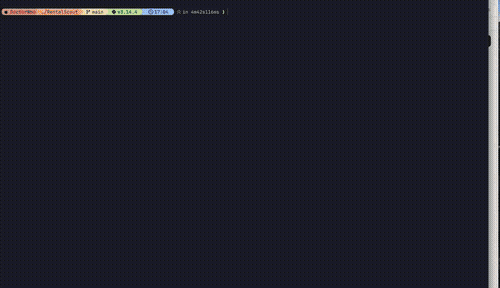

# RentalScout

<p align="center">
  
  
  
  
  
</p>

<p align="center">
  <b>一个把租房信息采集、清洗、地理分析和交互式筛选串起来的个人数据产品。</b>
</p>

RentalScout 聚焦上海浦东租房场景，把贝壳和 Wellcee 的房源统一整理到本地数据库，并提供地图、距离、价格、面积、位置价值和空间聚类等分析视图。它不是一个简单爬虫，而是一个从数据采集到决策界面的完整闭环：抓得到、洗得干净、看得清楚、能辅助选择。

## Demo



## 项目亮点

- **真实问题驱动**：围绕“如何在通勤、价格、面积和位置之间做租房决策”构建，而不是做通用模板项目。
- **多源房源整合**：支持 Wellcee 和贝壳两个来源，将不同结构的数据统一为同一套房源模型。
- **地图优先体验**：以工作地点为中心查看房源分布、距离桶、空间簇和附近房源性价比。
- **可恢复采集流程**：贝壳抓取支持断点恢复、详情页缓存复用、验证码人工介入提醒和 adaptive 降速策略。
- **本地优先与隐私友好**：数据保存在本地 SQLite；工作地点坐标不写入 `.env`，避免泄露隐私位置。
- **可解释分析**：价格、面积、距离、附近比较和聚类结果都保留可追溯字段，方便复核而不是只给黑盒打分。

## 能做什么

RentalScout 当前覆盖四个核心环节：

1. **采集**：从 Wellcee API/详情页和贝壳列表/详情页获取房源信息。
2. **清洗**：统一价格、面积、户型、小区、板块、经纬度、来源链接等字段。
3. **分析**：计算距离分桶、价格面积分位数、附近房源价值、空间聚类和数据质量标签。
4. **展示**：用 Streamlit 构建本地交互式工作台，在地图和表格中筛选候选房源。

## 产品界面

工作台包含：

- 地图视图：查看房源点位、聚类、距离分布和来源链接。
- 质量视图：区分 ready / caution / blocked 房源。
- 距离分析：按工作地点生成 4km、8km、12km 分桶。
- 价格面积分析：比较同距离范围内的租金和单位面积价格。
- 位置价值分析：用附近房源和同小区样本判断是否划算。
- 房源表格：按来源、价格、面积、距离和标签筛选。

## 技术能力展示

这个项目体现的工程能力：

- Web 数据采集与反爬压力下的低频、可恢复抓取设计。
- Pydantic 数据建模和 SQLite 本地持久化。
- 地理空间分析、Haversine 距离计算和 DBSCAN 风格聚类。
- 数据质量分层、异常检测和可解释标签设计。
- Streamlit + Leaflet 的本地分析工作台。
- pytest / Ruff 驱动的基础质量保障。

## 技术栈

| Layer | Stack |
| --- | --- |
| Language | Python 3.13 |
| Crawling | Scrapy, curl_cffi, Chrome profile scraping |
| Data Model | Pydantic v2 |
| Storage | SQLite |
| Analysis | pandas, custom geospatial algorithms |
| UI | Streamlit, Leaflet |
| Tooling | uv, pytest, Ruff |

## 快速运行

安装依赖：

```bash
uv sync
```

启动工作台：

```bash
uv run streamlit run rentalscout/web/streamlit_app.py
```

运行测试：

```bash
uv run pytest
```

抓取贝壳数据示例：

```bash
uv run python scripts/extract_cookies.py
uv run python -m rentalscout.cli crawl-phase1 \
  --beike-pages 20 \
  --wellcee-pages 0 \
  --beike-profile safe \
  --beike-adaptive
```

## 当前状态

- Wellcee 数据链路较完整，适合作为主要分析来源。
- 贝壳已支持详情页解析、经纬度提取、断点恢复和限速 profile，但仍需要低频运行并保留人工处理验证码的空间。
- 数据采集仅用于个人研究和租房辅助决策，应遵守目标网站服务条款并避免高压抓取。

## 下一步

- 增加定时刷新任务，沉淀房源生命周期和价格变化。
- 继续优化贝壳采集的稳定性和 adaptive 降速策略。
- 将工作台进一步打磨成更接近真实租房决策工具的产品体验。
